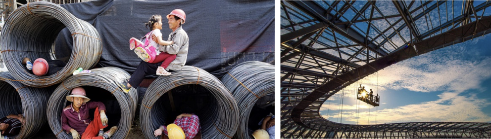
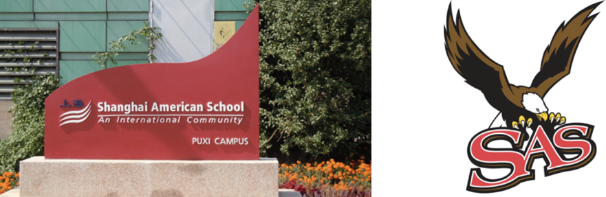

# 关于我们

农民工特指来到大城市打工的农业劳动者。作为城市中的廉价劳动力，他们属于最低收入人群。他们亲手建设了世界上最辉煌的城市，但却无法享受真正的城市生活。

Migrant workers refer to agricultural labors in rural hinterland of China coming to work in big cities. They are the cheap labors and the lowest earners in society. They build some of the world's greatest skylines. But they don't take part in the life of the cities they build.

刘伏波是上海美国学校的高中生。从学前班开始，他常常去学校附近的一个农民工子弟小学，参加上海美国学校组织的很多活动，例如：为农民工子弟捐献衣物、运动器材、书籍等，辅导他们英语、跟他们一起做课外活动。。。从一开始，刘伏波就意识到，农民工家庭来到上海生活遇到许多困难，而最大的困难就是就业。于是他想帮助他们，并开始研究农民工就业市场。很多年以后，他有了成立“农民工职业协助中心”（MWCAC）的设想，并开始付诸实施。

Jasper Liu is a high school student in Shanghai American School (SAS). Starting from his Pre-K in SAS, he often visited a school for migrant workers’ children (migrant children), not far away from SAS. Together with other students in SAS, he participated in many activities organized by SAS to help the students in that migrant children school. They donated clothes, sport equipment, text books etc.; tutored English; and had joint after school activities with the migrant children. He knew from every beginning that life is not easy for those migrant workers’ families, and decided to help. The biggest challenge for migrant workers is their career development in big cities like Shanghai. Jasper did research about the job markets for migrant workers for many years and eventually came up with the idea of Migrant Workers Career Assistant Center (MWCAC).

MWCAC 是一个非营利性机构，提供支持农民工职业发展的一站式服务。MWCAC 协助农民工充分利用政府和社会资源,接受职业技能培训、获得经济资助和法律援助、找工作。

MWCAC is a not-for-profit organization providing one-stop services helping migrant workers in Shanghai with their career development. By coordinating and working with our partners, MWCAC helps migrant workers access to government and private resources for vocational training, job placement, financial support and legal aids.

请您在我们农民工信息库中注册，注册时请提供您详细的教育背景、工作经历以及您的需求。

MWCAC is a not-for-profit organization. It is the first organization providing one-stop services helping migrant workers in Shanghai with their career development in big cities. By coordinating and working with our partners, MWCAC delivers integrated solutions to help migrant workers access to government and private resources for vocational training, job placement, financial support and legal aids.

Please register in our Database for Migrant Workers by providing detailed education background, work experience and your requirement.

<iframe height="800" allowTransparency="true" scrolling="no" style="display:block;min-width:100%;width:100px;border:none;overflow:auto;" frameborder="0" src="http://jasper2020.mikecrm.com/pU9XEMT"></iframe>