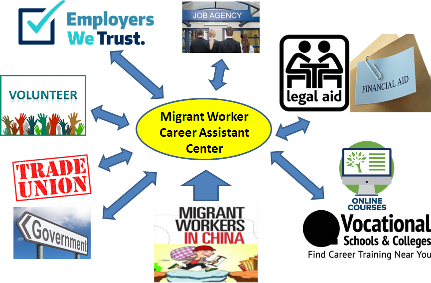

# 首页

美好的前程从农民工职业中心开始

A bright future starts at the Migrant Workers Career Assistant（MWCAC）

## 我们的愿景

## Our Vision

帮助农民短时间内转化成为合格的城市工作者

FACILITATE the Effective Transition of Agriculture Labors to City Workers

## 我们的使命

## Our Mission

提供一站式服务，解决农民工在城市就业中所遇到的所有问题

MWCAC provides One-Stop Services to Help Migrant Workers with their career development in big Cities in China

## 我们的服务

## Our Services

* By building connections between migrant workers and our partners, MWCAC offers the following services:

* 职业技能培训

* Vocational training

* 找工作

* Job placement

* 法律援助和经济援助

* Legal aids and Financial aids

