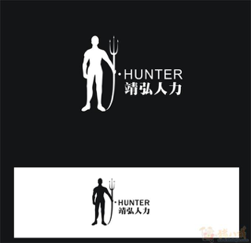

# 农民工找工作

中国有很多找工作网站，农民工可以在这些网站上找工作。但这种方法效果不一定很好，因为这些商业化猎头的注意力都集中在高端工作岗位上。MWCAC 与那些专门为农民工找工作的招聘机构建立了伙伴关系，同时也与一些企业有直接联系。我们可以介绍您与这些专业猎头和企业联系。MWCAC 与政府和工会支持农民工就业的部门保持联系，随时可以推荐您应聘政府和工会手中掌握的就业机会

Using the popular job listing websites in China for job search may not be a good solution for migrant workers. A commercial job agency often focuses its attention on high end jobs. MWCAC builds partnerships with some employment agency specializing at job opportunities for migrant workers. We also work with some government sponsored agencies with services solely for migrant workers’ job placement. We communicate with those specialized or dedicated agencies on regular basis, referring selected migrant workers in our database to them and follow up with their actions. We have some of the job listing websites below. You may directly go to the sites for their services or contact us for assistance.

