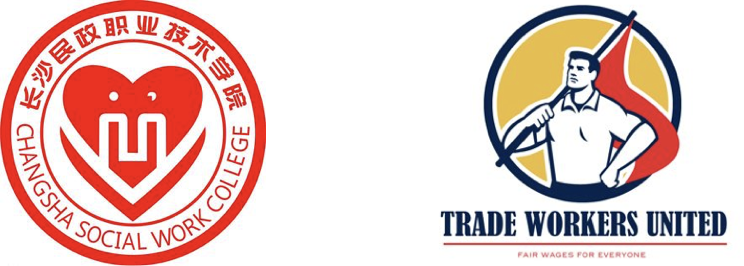
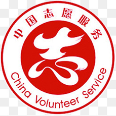

# 合作伙伴与志愿者

## 合作伙伴

## Partners

* 大专院校的成人教育和培训机构
* Universities and community colleges offering adult education programs

* 职业技能培训学校
* Vocational training schools

* 技工学校
* Technical schools

* 街道办事处
* Administrations of local communities

* 工会
* Trade Unions

* 当地人力资源和社会保障局分支机关
* Local Administrations of China Human Resources and Social Securities

* 专注给农民工找工作的猎头公司
* Job agencies specialized in job placement for migrant workers

## 志愿者

## Volunteers

我们需要志愿者与农民工沟通并提供帮助；建立和维护我们的农民工信息数据库；协助农民工准备各种文件；申请职业技能培训；申请经济资助和法律援助，推荐农民工给招聘机构和企业。请您注册成为一名志愿者，我们可以灵活安排您的服务时间

We need volunteers to communicate with migrant workers about their requirement and offer assistance; update our database for migrant worker information, apply for vocational training programs; prepare documents for financial aids and legal aids; and refer migrant workers to job agency and companies. Please register yourself as volunteer now and find out how you can help! We can accommodate all kinds of schedules.  