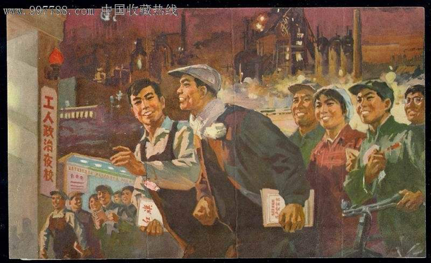

# 农民工职业技能培训

实践证明，职业技能培训是农民工最有效的提高职场竞争力的方法。中国有许多组织提供这样的职业技能培训，包括大学成人教育部、中专和大专院校、专业培训机构，技工学校、工会以及相关政府部门。中国政府专门为农民工职业培训投入大量资源。很多企业也为农民工提供公在司内的学徒、培训生等机会。

Vocational training is the most effective way for migrant workers to build competencies in job market. In China, universities, community colleges, private training agencies, technical schools, trade unions and local communities are offering many programs of adult education and vocational training. Chinese governments each year spend big money to support some training programs specifically designed for migrant workers. Some companies also sponsor such programs or offer onsite apprentice/trainee programs in their own construction sites or production facilities.

由于职业技能培训是由很多不同的组织和机构提供的，而且培训种类繁多，农民工很难找到适合于自己的培训项目和培训机构。MWCAC 为您收集了大量的培训机构和培训内容信息。您可以自己和这些培训机构联系，我们和志愿者也可以帮您联系、申请这些培训机会。根据您的教育背景和工作经历以及职业发展目标，我们可以为您分析选择最适合和有效的培训机会。您结束培训之后，我们仍然和您一起共同向下一个职业发展目标迈进。

Since the vocational trainings are offered or organized by so many different authorities and agencies, it is difficult for migrant workers to access to the training information, and identify the right learning opportunities for them. MWCAC has developed a consolidated list of all vocational training agency in Shanghai. We can provide you with the contacts for your direct communication with the agencies. Our staffs and volunteers can also select agencies and programs for you, based on your background and requirement. Most importantly, we will analyze your situation and recommend the best training solutions for you, to ensure an effective learning experience, which will enable you to achieve expected career goals. After you complete your training, you can use our Job Placement services to continue your career development journey with us.